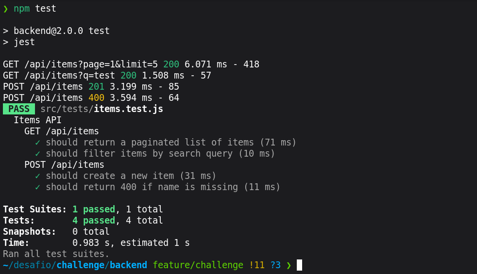
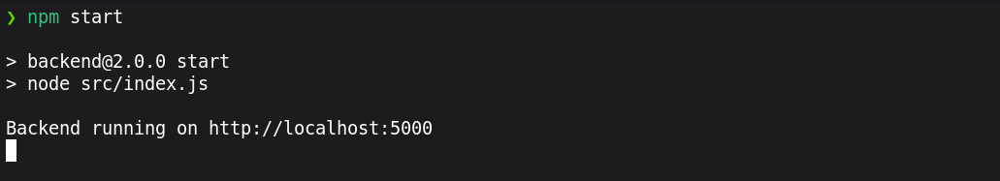
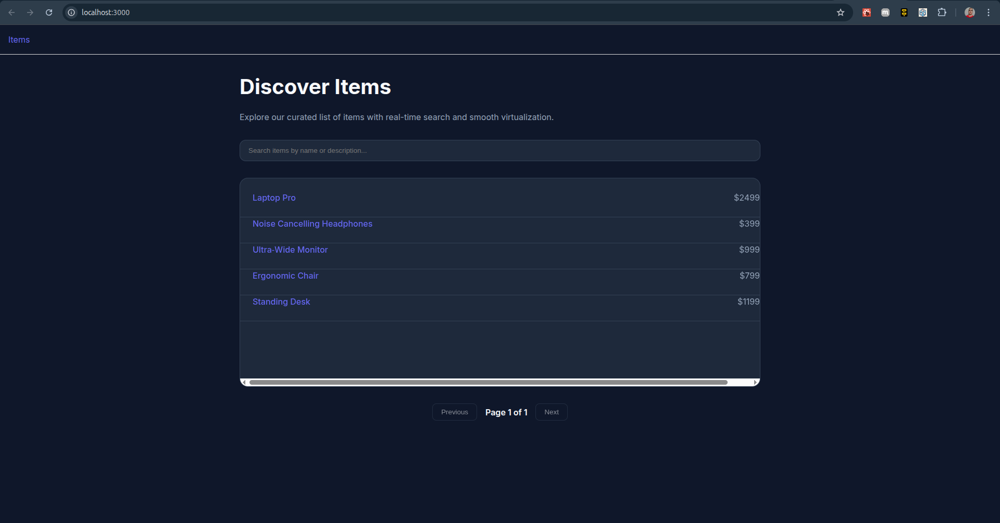
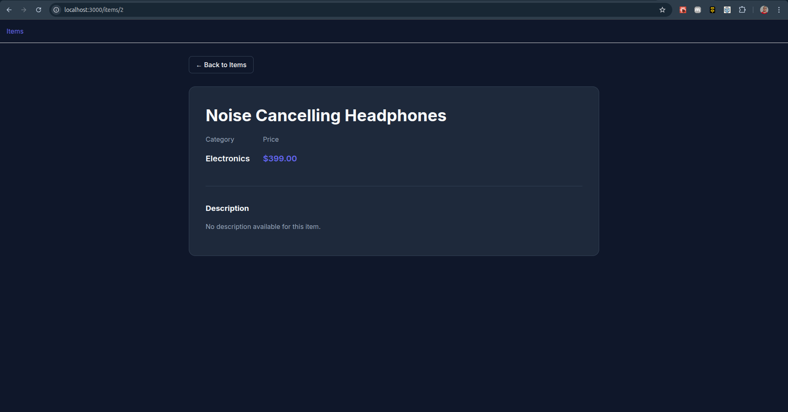

# Challenge Solution - AI Coding Assistant

## Overview
This solution addresses all the issues identified in the Take-Home Assessment, focusing on performance, scalability, and code quality.

## Backend Improvements

### 1. Non-Blocking I/O
- Refactored `src/routes/items.js` to use `fs.promises`.
- All file operations are now asynchronous, preventing the event loop from blocking and improving server throughput.

### 2. Stats Caching & Performance
- Implemented a robust caching mechanism in `src/routes/stats.js`.
- Instead of persistent watchers that can lead to open handles in test environments, the system uses a high-performance `mtime` (modified time) check to validate the cache before serving.
- This ensures that stats calculations are only performed when the underlying data has actually changed.

### 5. Security & Cleanup
- Removed dangerous dynamic code execution in `errorHandler.js` that used `eval`-like patterns.
- Standardized error handling with a centralized Express middleware for predictable JSON responses.

### 3. Server-Side Pagination & Search
- Enhanced `GET /api/items` to support `page`, `limit`, and `q` (search) parameters.
- Search now looks through both `name` and `description`.
- Pagination ensures the server only sends the required slice of data, reducing payload size.

### 4. Robust Testing
- Added a comprehensive test suite in `src/tests/items.test.js` using Jest and Supertest.
- Covered happy paths (pagination, search) and error cases (validation failures).

## Frontend Improvements

### 1. Memory Leak Fix
- Used an `active` flag pattern in `useEffect` (and `AbortController` ready logic) to prevent state updates on unmounted components.

### 2. List Virtualization
- Integrated `react-window` (`FixedSizeList`) to handle large datasets.
- This keeps the UI responsive even with thousands of items by only rendering visible rows.

### 3. Enhanced UI/UX
- Implemented a premium dark-themed design system using Vanilla CSS.
- Added a search input with debounce (500ms) to avoid unnecessary API calls while typing.
- Implemented custom pagination controls.
- Added skeleton loading states for a smoother perceived performance.
- Configured a **Proxy** in `package.json` to handle the port mismatch between backend (5000) and frontend (3000), making the application easier to develop and deploy.

## Trade-offs and Considerations
- **Caching**: The `mtime` strategy is perfect for single-server file-based storage. For distributed systems, Redis is still the recommended path.
- **Virtualization**: Forced use of `react-window` v1.8.10 (stable) to ensure maximum compatibility and avoid runtime issues found in newer experimental versions.
- **State Management**: For a larger app, I might use a more robust state management solution or a data fetching library like React Query for better caching and sync.

## Results

#### tests

#### run backend

#### run frontend

